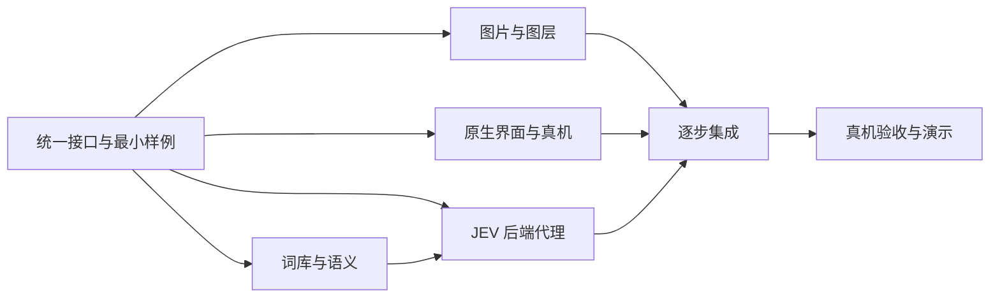

# JEV — 原生 MVP 执行方案

实施入口：原生首版已在 [ios/](ios/README.md) 创建；素材描述词见 [ASSET-PROMPTS.md](docs/ASSET-PROMPTS.md)，已到位图片的生成记录见 [ASSET-GENERATION-LOG.md](docs/ASSET-GENERATION-LOG.md)。以下原始四小时执行表保留作背景，不能作为已完成项清单。

2026-09-27 体验方向更新：先读 [全屏预言家视觉与交互草案](docs/experience-direction.md)。全屏场景、连续对话、逐词呈现和会话历史超出本文原始范围；本文排期与 P0/P1 划分尚未据此重估。现有接口仍是单次完整 JSON，连续对话字段与可能的流式协议必须在实现前更新契约。

状态：执行准备稿；本轮完成任务拆分、接口与验收设计，没有创建 App、生成最终图片或进行真实模型调用。以下时间从开始实现的 T0 计，按剩余约 4 小时估算，不代表保证交付。

## 1. 本轮冻结的产品范围

- 英文产品，三个角色：**Oracle / Stone / Jester**，不设中文名。
- Oracle：Matrix Oracle 的温暖、从容形象；JEV 从含蓄完整短答中选择一句。
- Stone：Monolith 方向，严肃、神秘；JEV 连续选择三个名词或名词短语。
- Jester：不可预测、反常、像知道太多的弄臣；JEV 从有限词组组合出短小悖论或荒诞回应。
- iOS 原生，目标是用户自己的 iPhone 真机演示。建议 iOS 17+，先验证手机实际版本。
- **视觉采用分层视差图片**，SwiftUI 图片合成 + Core Motion；移除真正的 3D 模型、RealityKit、USDZ 和 AR 依赖。
- 语音转文字后允许修改和确认，保留键盘输入。一次提问只向一位角色请求回应。
- 完成一次私人启示是 P0；历史记录、个人解释保存、追问、分享均为 P1。

## 2. 四个角色同时推进

当前最多四个并发 Agent，因此按「主 Agent + 三个专项 Agent」执行。主 Agent 同时负责后端与集成，不再额外开第五个常驻 Agent。

| 执行角色 | 负责什么 | 必须交付 | 独占范围 |
| --- | --- | --- | --- |
| Lead / Integration | 接口、JEV 后端代理、内容校验、联调、真机验收与删减决策 | 一个真实可用的 reading 接口、内容验证结果、演示记录 | `server/`、`contracts/`、`tests/integration/`、根文档 |
| A · Visual & Assets | 视觉风格、角色图片、分层资源、状态动效规范 | 三个角色的母图与可合成图层、manifest、视觉参数、来源记录 | `assets/`、`docs/workstreams/design-assets.md` |
| B · Language & Meaning | 候选词表、隐性语义、组合规则、评估题 | 三份有版本号的词库、语义字典、评估集 | `content/`、`tests/content/`、`docs/workstreams/language-system.md` |
| C · Native Experience | Xcode 工程、SwiftUI 主流程、图片合成、语音、姿态输入 | 能安装到 iPhone 的 App、fixture 模式与真实 API 客户端 | `ios/`、`tests/ios/`、`docs/workstreams/ios-architecture.md` |

`ios/` 内的项目文件、资源登记、Signing 设置仅由 C 修改。A 在 `assets/` 交付，C 负责导入；B 在 `content/` 交付，Lead 负责服务端加载。共享数据类型由 Lead 的契约定义，C 按契约生成 Swift 类型，不共同编辑同一文件。

每次交接只需：交付文件、如何验证、实际验证结果、尚未完成项。依赖有变更先发给 Lead，不自行修改其他 Agent 的接口。

## 3. 并行与依赖

界面不等图片：先用固定尺寸的占位图层。后端不等完整词库：先用少量正式结构的候选。图片不等工程：先按统一画布交付。完成一小块就接入，禁止最后半小时才第一次联调。

## 4. 阶段与交付门槛

| 阶段 | Lead | A · 图片 | B · 语言 | C · 原生 | 全局验收 |
| --- | --- | --- | --- | --- | --- |
| T0–20 min | 冻结契约；启动 Oracle 小样接口 | 主舞台构图、统一色调；先做 Stone | 12 条 Oracle、18 个 Stone、12 个 Jester 片段作为首批种子 | 最小工程；确认签名、iPhone OS 和安装 | **手机上能打开 App；接口与样例结构确定** |
| 20–60 min | 连通 JEV；完成 Oracle 一次选择 | Stone 可用图层；Oracle/Jester 母图 | 语义描述、可组合性与样例题 | 输入 → 请求 → 显示；Core Motion 占位图层 | **iPhone 输入问题，看到真实 Oracle 回应** |
| 60–120 min | Stone/Jester 顺序选择、错误与终止规则 | 三角色可用图片；完成最关键的主体分层 | 扩充并冻结第一版词库 | 三角色切换、视差、语音识别与编辑确认 | **三角色全流程接通，语音与文字两条路径可用** |
| 120–180 min | 真实小样评估、响应时间与异常 | 补边、去残影、统一光线；控制改图轮次 | 修复万能短答、重复意象、拼接不通顺 | 权限拒绝、网络失败、取消/切角色、Reduce Motion | **完整演示脚本连续通过** |
| 180–240 min | 冻结功能、真机回归、演示排练 | 只修影响体验的问题 | 只修已观察到的问题 | 性能与布局检查；有余力才做 P1 | **可交给用户亲自操作** |

第 20 分钟的真机安装门槛需要用户协助解锁、连接设备、信任电脑以及在系统要求时开启开发者模式。若 Signing 或设备条件阻塞，立即暴露，不把模拟器成功视为真机交付。其他 Agent 继续图片、词库和后端工作。

## 5. 最小技术结构

`SwiftUI → ReadingClient → 后端 /v1/readings → JEV Choice → 校验并返回候选原文`

- 前端不携带 TypeSafe 密钥。后端掌握词库版本、候选集合与选择顺序。
- P0 一次请求返回完整 JSON，后端内部完成 1 / 3 / 2–4 次模型选择；暂不开发流式协议与断点恢复。
- 返回后可以逐行淡入，这是展示动画，不声称模型实时流式输出。
- 用 `requestId` 隔离请求，切角色或取消后丢弃旧结果；重试需要明确的新操作。
- UI 状态与设备姿态分开，传感器更新只影响图片区域，避免整屏每帧重绘。
- 优先使用已有可用 HTTPS 后端；若没有，先用 Mac 本地演示代理并验证 iPhone 网络可达性。本地网络权限、开发构建的传输策略及同网段问题在首个端到端门槛解决，不能把手机的 localhost 指向 Mac。

详细共享协议见 [CONTRACTS.md](docs/CONTRACTS.md)。

## 6. 隐性编码的具体含义

每个候选有三部分：稳定 ID、用户看到的英文、模型看到的语义说明。

例如 Stone 的 `A threshold.`：暗示「边界、进入下一阶段、尚未迈出的开始」，适用于开始/转变的犹豫；不凭空推断某个关系已经破裂。编码 `transition.beginning` 用于维护与评估；实际说明以自然语言传给 JEV，不能只传一个模型未被定义过的代号。

同一套意义可以有三种表达：Oracle 给一句含蓄短答，Stone 给一个意象，Jester 给一个颠倒常识的片段。先通过候选描述实现，不增加前置分类模型调用，也不向用户自动解释每个词。

## 7. 图片生产的边界

- imagegen 用于母图、角色透明图层和补全背景；输出是位图，不是可旋转模型。
- 每个角色优先 3 层：background / subject / foreground；前景没有必要时允许只交付背景与主体。
- 所有层保留同一画布、位置与比例；背景必须补全原来被主体遮挡的区域。只把人物抠出但留下背景上的原人物，会产生双影，不算合格。
- 视差用小幅、平滑位移营造纵深。图片区域裁切并预留外扩，倾斜到上限仍不能露出透明边或空洞。
- P0 可以先接一张完整角色图做浅视差，清楚记录分层尚未完成；最终优先保证三位角色的视觉一致性，再补前景细节。
- 此方案以视觉效果为目标，不假设可直接调用 iOS 锁屏的私有立体照片转换流程，也不把系统自动深度图生成当作依赖。

## 8. 核心验收

1. **模型真实**：每个展示片段都能追溯到所用词库版本和候选 ID；不能用随机数或手工挑好的结果冒充 JEV。
2. **角色成立**：Oracle 一条完整短答；Stone 恰好三个名词；Jester 在 2–4 步内完成可读、有关联的反常短句。
3. **语义可维护**：所有候选有适用情境、避免情境和必要对比；不同问题不能长期落在少数万能句上。
4. **真机可玩**：三位角色都能选；英文文字/语音都能提交；语音文本可改；权限被拒仍可继续输入。
5. **视差可靠**：倾斜无露边、无双影；文字不跟着漂；Reduce Motion 可静态展示；切后台停止传感器与录音。
6. **错误诚实**：网络失败、模型错误、未完成不会伪装为完整神谕；旧请求不覆盖当前角色；凭据不进入 UI 或日志。
7. **演示完整**：一台真实 iPhone 上完成三角色各一次，再完成一次失败恢复。约 15 秒的响应时长只是初始目标，记录实测而不预先宣称达标。

测试重点是内容结构/组合规则、API 状态与取消、真机输入和视差，不为静态色值或简单布局写机械测试。首轮 12 个代表性问题，每题三角色；先用极小冒烟集定位问题，再决定是否跑完整 36 次评估，记录实际调用次数与费用。

## 9. 时间不足时的删减顺序

先删保存、分享、追问；再减复杂前景、漂浮粒子与二次动画；再缩词库数量。保留三角色不同语言机制、真实 JEV、文字输入、统一视觉与基本倾斜视差。若语音设备条件阻塞，保留明确文字路径并报告语音未达标，不能悄悄把它算完成。

## 10. 分项执行包

- [设计与分层素材](docs/workstreams/design-assets.md)
- [语言系统与隐性编码](docs/workstreams/language-system.md)
- [原生架构与设备验证](docs/workstreams/ios-architecture.md)
- [共享接口与资源契约](docs/CONTRACTS.md)
- [Skills 选择与使用范围](docs/SKILLS.md)

这些分项中如果有字段或目录差异，以本执行方案和 CONTRACTS.md 为准。开始实现时先同步契约，再允许各 Agent 在自己的范围内推进。

## 11. Lead 执行提示

> 按 EXECUTION-PLAN.md 与 docs/CONTRACTS.md 实现 iPhone MVP。你负责 server/、contracts/、集成测试和根文档，另三个 Agent 分别负责 assets/、content/、ios/。先建最小候选校验器与 Oracle 的 /v1/readings 接口，连通真实 JEV，再扩展 Stone 和 Jester；不用第二个模型润色。首次真机端到端连通优先于扩充词表。核对子 Agent 的交付，不凭状态汇报声称完成；公开报告缺失图片、语音/网络/签名问题。只实现 P0，稳定后再做 P1。
