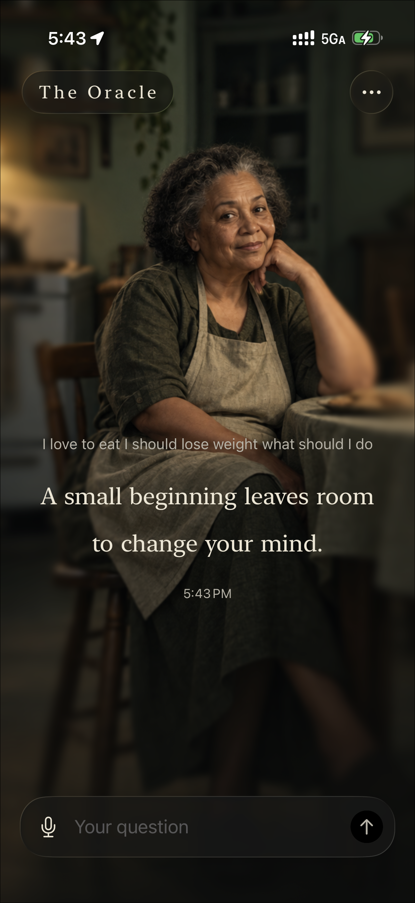
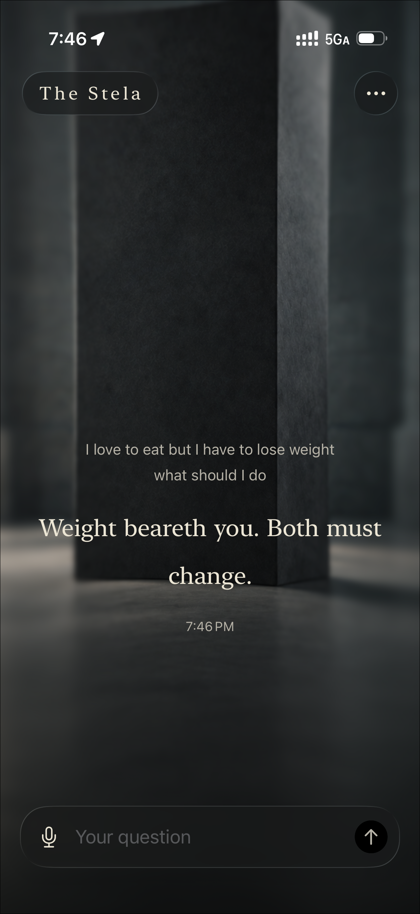
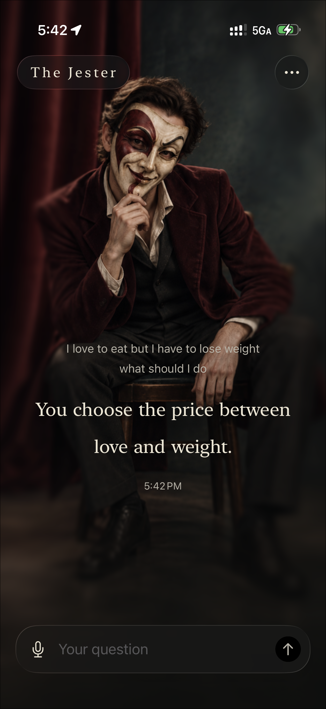
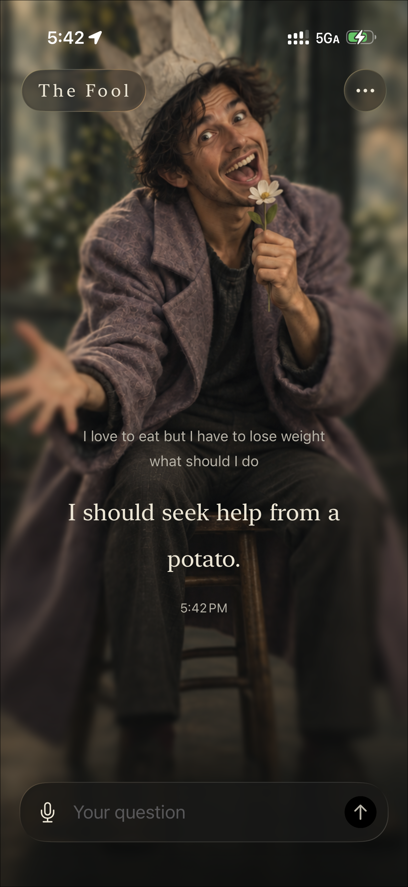
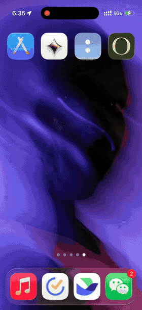
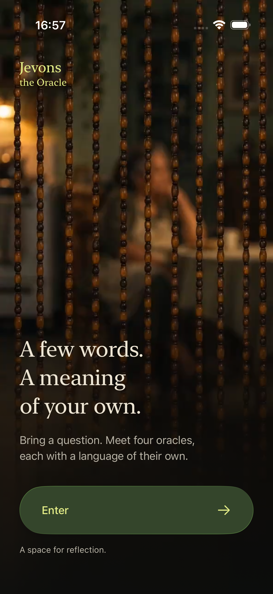
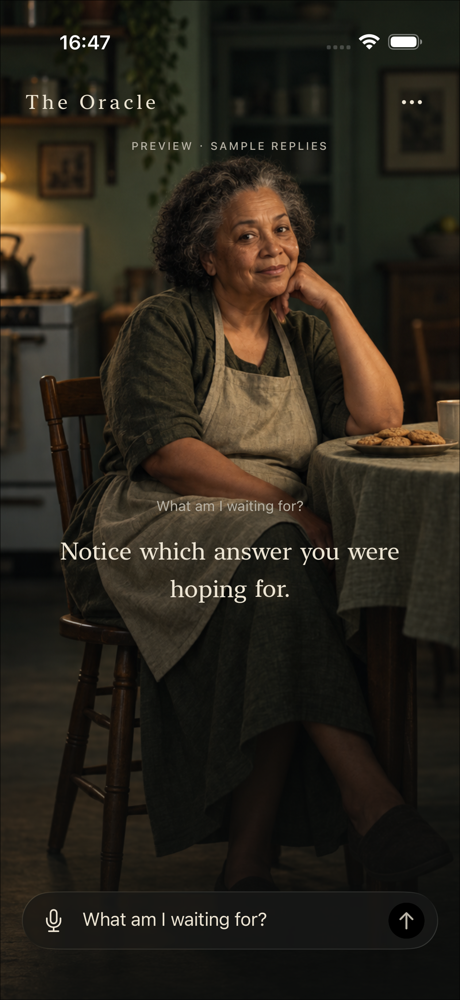
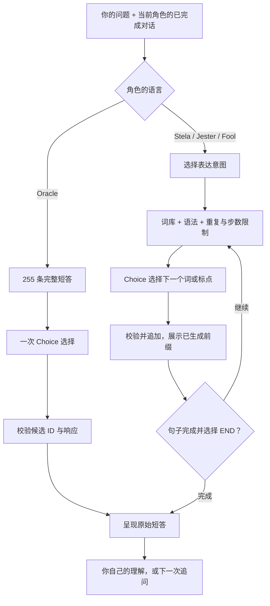

<div align="center">

# Jevons the Oracle

**向只拥有有限词语的神，问一个暂时没有答案的问题。**

*A few words. A meaning of your own.*

iOS 原生体验 · 四位角色 · 中英文回答 · 有限语言实验

</div>

<table>
  <tr>
    <td align="center" width="25%"><br /><strong>The Oracle</strong><br />一句话，留下余地。</td>
    <td align="center" width="25%"><br /><strong>The Stela</strong><br />让问题成为一段铭文。</td>
    <td align="center" width="25%"><br /><strong>The Jester</strong><br />给确信一个意外的转身。</td>
    <td align="center" width="25%"><br /><strong>The Fool</strong><br />让日常稍微不合常理。</td>
  </tr>
</table>

## 视频演示

<p align="center">
  <a href="docs/media/demo.mp4">
    
  </a>
</p>

<p align="center"><strong><a href="docs/media/demo.mp4">打开完整 Demo · 4 分 23 秒</a></strong><br /><sub>上方为前 12 秒动态预览。完整 MP4 保留原始分辨率，约 9.6 MB。</sub></p>

## 起点：如果 AI 只能说很少的话

有些问题，我们已经想过很多遍：为什么迟迟不敢开始？为什么总想得到别人的允许？一段关系结束以后，还剩下什么？

这个黑客松项目从一个假设出发：**一句与处境有关、又没有替人下结论的话，能不能让人重新看见自己的问题？**

Jevons the Oracle（仓库简称 JEV）把这个假设做成了一次短暂的相遇。你带着问题走进帘幕后，与四位拥有不同语言的角色对话。它们的表达受到明确限制：有的只能挑选一句完整短答，有的只能从固定词库里逐词组成回应。你可以继续追问，也可以停在那句话上，形成自己的理解。

我们想探索的是：语言的边界如何塑造性格，留白如何邀请参与，以及 AI 能否为人的思考留出空间。

## 体验：掀开帘幕，遇见一个声音

<p align="center">
  
  &nbsp;&nbsp;
  
</p>

<p align="center"><sub>iOS 模拟器截图。右图为明确标记的 Sample reply，用于展示交互与排版。</sub></p>

1. **进入。** 点击入口，珠帘在一段约五秒的视频与声音中打开，画面融入 Oracle 的房间。
2. **选择。** 左右滑动，在 Oracle、Stela、Jester、Fool 之间循环切换；每位角色保留自己的草稿与会话。
3. **提问。** 输入文字，或在输入框空闲时按住说话、松开发送。独立麦克风按钮也支持先转写、再编辑提交。
4. **等一句话到来。** 已通过校验的词随选择结果逐步出现，短暂发光；场景与输入框保持连续。
5. **继续或回望。** 追问同一位角色，上下翻看此前的对话。也可以换一个声音，重新面对同一个问题。

设置中可选择 English 或简体中文作为**回答语言**；中文使用独立词库与组句规则。当前界面主体仍为英文。

## 四位角色，四种面对问题的方式

角色的差异同时写进了词汇、语法、选择说明与画面。

| 角色 | 想带来的视角 | 当前语言机制 |
| --- | --- | --- |
| **The Oracle · 先知** | 温暖、克制，提醒你留意自己的愿望与迟疑 | 从 **255 条人工编写的完整短答**中选择一条，原样呈现；个性化发生在选择环节 |
| **The Stela · 石碑** | 用时间、重量、路径与物象，把问题拉远一点 | 从有限词库逐词组句；英文带古雅铭文语气，中文尝试简练文言 |
| **The Jester · 弄臣** | 用反问或对照，碰一下问题中习以为常的前提 | 从有限词库逐词组句，强调具体问题与意外转折之间的联系 |
| **The Fool · 愚者** | 用错位的日常事物，让过于严肃的处境松动一下 | 从有限词库逐词组句，尝试形成一个可理解的荒诞小场景 |

每种语言下，每位角色都有 **255 个候选位**。Oracle 的候选是整句；另外三位各有 **249 个词、5 个标点与 1 个 END**。两种语言共八套词库、2,040 个候选位；逐词角色每一步只提供当前规则允许的子集。

完整内容可查看[英文词库](docs/vocabulary/current-vocabulary.md)与[中文词库](docs/vocabulary/chinese-vocabulary.md)。The Stela 在代码中沿用 `stone` ID，便于兼容早期版本。

## 核心机制：把「能说什么」做成产品的一部分

每一步，JEV 都向 TypeSafe 的 Choice 接口提交明确候选，再把经过校验的选择映射回词库文本。逐词角色先选择表达意图，再结合问题、同角色历史与已经生成的前缀继续选择。



**词的背后还有语义。** 候选可以携带 `meaning`、`useWhen`、`avoidWhen` 等说明。例如，一个物象适合承载怎样的处境、何时容易成为牵强的比喻。这些说明会进入真实选择请求，让有限词汇与具体问题建立联系。

**规则负责让语言有边界。** 本地引擎筛选合法接法，控制词数、步数、重复与停止条件；没有额外的模型润色环节。逐词显现来自每次真实选择后的增量交付，Oracle 则一次选定整句后做文字入场动画。

**失败也有明确来源。** 超时、连接或组句失败时，App 会显示标明原因的角色备用回复。样例与备用回复均不进入后续真实对话上下文，也不计作模型生成成功。

## 设计思考：让限制、空间与留白彼此呼应

### 语言的限制，能否成为可感知的性格？

Oracle 总能说出完整短句，代价是表达范围由作者预先界定；逐词角色拥有更多组合可能，也更容易失去自然度。这种取舍贯穿了整个项目：我们希望角色的声音既有稳定边界，又能与眼前的问题发生关系。人格是否成立，需要通过不同问题、不同轮次的实际体验来判断。

### 留白需要一个与问题有关的落点

我们把回应的目标设为「让人产生自己的解释」。一句话可以有多种读法，但应当保留一处具体联系，让用户能说出它为什么触动了自己。纯随机的意象、适用于所有问题的格言，以及难以理解的句子，都会削弱这种体验。

未来的用户观察会关注：人们能否解释自己的联想、能否分辨四位角色、是否愿意继续思考。预测是否“命中”不作为质量标准。

### 空间先建立相遇，文字再获得注意力

珠帘给进入留下一点时间；全屏场景让角色拥有自己的房间；新的短答占据当前舞台，旧对话通过纵向翻阅保留。文字不需要和整屏消息争夺注意力。

视觉上，当前实现用**完整原图 + 连续深度场 + 手机姿态**营造屏幕后方的纵深。离线估计的深度交给 Metal 做有限幅度的重投影，人物、支撑物与接触阴影一起移动。画面边缘柔化，文字与控件保持清晰；Reduce Motion 下保留静态体验。这是一种基于图像的空间错觉，视角范围有限。

### 约束能保证形式，内容仍需要实验

早期逐词实验曾出现 `Eraser a eraser fear is keeps fear.`。它暴露了一个很实际的问题：每一步都选中了合法候选，整句依然可能不成立。后续迭代增加了语法过滤、表达意图、完整前缀比较与意象关系说明，也修复了合法短句无法结束的规则死路。

这些经历促使我们把工程完成、语言自然、语义贴合与角色辨识度分别验证。仓库保留了失败和中间版本，方便继续追问：究竟是哪一层约束帮助了表达，又是哪一层把它困住了？

## 实验里实际说过的话

以下是 **2026-09-27 不同迭代阶段**记录的真实输出摘选，未经润色。它们展示可能出现的体验，不代表当前版本每次都能达到同样效果；各链接保留完整实验过程与不理想样本。

| 角色 | 测试问题 | 原样回应 | 记录 |
| --- | --- | --- | --- |
| Oracle | 我该和女朋友分手吗？ | 告诉我，你希望每种答案替你守住什么。 | [中文直连实验](docs/verification/chinese-stela-2026-09-27.md) |
| Stela | 我总是不敢开始，该怎么办？ | 若步行，则路开。 | [石碑修订实验](docs/verification/chinese-stela-2026-09-27.md) |
| Jester | Should I leave my girl? | Why do you want permission to leave? | [反问与收尾修订](docs/verification/jester-2026-09-27.md) |

最新一轮 Fool / Stela 意象关系测试中，**六条请求均因超时或传输错误而未完整完成**，使用了明确标记的备用回复。现有记录不能定位网络或服务端的具体根因，也尚未证明这轮修改改善了完整回答的质量。详见[意象关系实验](docs/verification/image-relations-2026-09-27.md)。

## 黑客松原型现在走到哪里

| 已实现 | 仍待验证或继续探索 |
| --- | --- |
| 四角色场景、循环切换、独立草稿与内存会话 | 更广泛问题下的自然度、贴合度与角色辨识度 |
| 中英文词库、原生语音输入、已校验词的增量显示 | 真实网络下的延迟与长回答完成率 |
| 入口视频与声音、连续深度效果、动态文字与减少动态效果支持 | 真机姿态手感、语音体验、GPU 表现与安装流程的系统验证 |
| App 直连、Keychain 密钥存储、取消与旧请求隔离 | 现场用户观察、个人解读记录与本机「回声簿」 |

当前问题、回复与草稿仅保存在内存，结束进程后不保留。密钥与偏好设置独立持久化。仓库中的模拟器与联网验证按具体版本记录，入口见 [verification](docs/verification/)；早期提案里的三角色、英文优先、服务端代理等描述属于历史方案。

## 在本地体验

需要 macOS、Xcode、XcodeGen，以及 iOS 17+ 的模拟器或 iPhone。项目验证记录使用 Xcode 26；原生工程没有外部包依赖。

```bash
cd ios
xcodegen generate
open JEV.xcodeproj
```

在 Xcode 中选择 `JEV` scheme 和可用的 iPhone 模拟器运行。真机运行需在 Signing & Capabilities 中选择自己的开发团队。

- **体验视觉与流程：** 在 Settings 开启 `Sample replies`。这是明确标记的预设样例模式。
- **体验真实选择：** 在 Settings 保存自己的 TypeSafe API key，关闭 `Sample replies`，选择回答语言后提问。App 直接连接供应商，无需启动本地服务器。

密钥仅存本机 Keychain，不随应用打包、不经 iCloud 同步；真实请求会把问题与用于追问的上下文发送给 TypeSafe。更多连接、词库同步与测试说明见 [iOS 使用指南](ios/README.md)和[直连说明](ios/DIRECT-JEV.md)。

<details>
<summary><strong>给想继续构建的人：工程地图</strong></summary>

| 位置 | 内容 |
| --- | --- |
| [ios/](ios/) | SwiftUI 应用；Core Motion 姿态、Metal 场景、Speech 输入与 AVFoundation 入场影音 |
| [engine.js](ios/JEV/Resources/Language/engine.js) | 在 JavaScriptCore 中运行的本地组句与候选过滤规则 |
| [DirectJEVClient.swift](ios/JEV/DirectJEVClient.swift) | TypeSafe 直连、密钥管理、响应校验与增量交付 |
| [experiments/language/](experiments/language/) | Python 参考引擎、词库、语义说明、实验与原始结果 |
| [docs/vocabulary/](docs/vocabulary/) | 可审阅的中英文词库与结构化快照 |
| [assets/](assets/) | 角色原图、深度素材、品牌、原始音视频与历史视觉迭代 |
| [server/](server/) | 可选的 Python 开发服务；当前 App 体验不依赖它 |

离线语言与跨端规则检查，在仓库根目录运行：

```bash
python3 -m unittest discover -s experiments/language -p 'test_*.py' -v
python3 -m unittest discover -s tests/integration -v
```

设计取舍可继续阅读 [DESIGN.md](DESIGN.md)，最初的产品探索保留在 [MVP-PROPOSAL.md](MVP-PROPOSAL.md)。这些文档记录了演变过程；使用方式以当前代码与直连说明为准。

</details>
